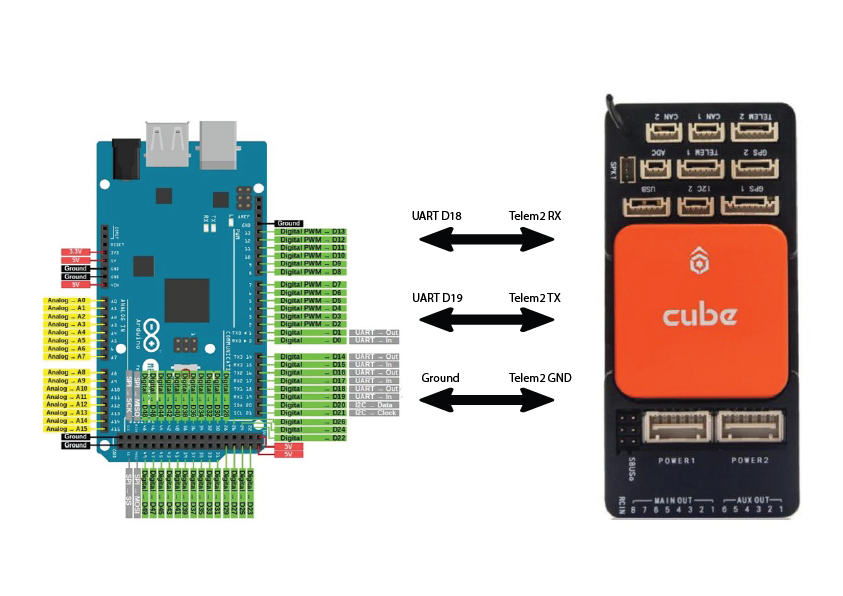
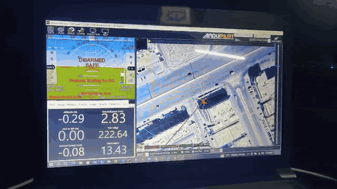
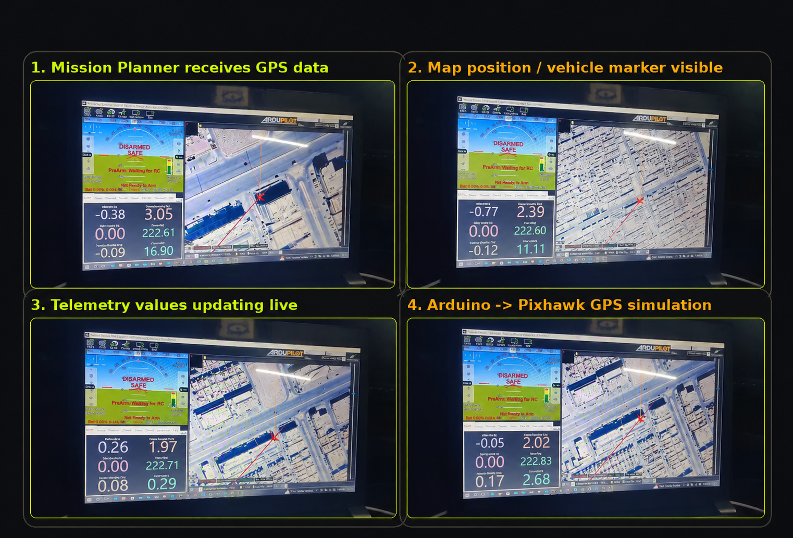

# Orange Cube Plus External GPS Simulator — Arduino Mega

A practical MAVLink project for simulating an external GPS source using an **Arduino Mega** connected to a **Pixhawk Orange Cube Plus**. The Arduino sends GPS data to the Pixhawk over UART so Mission Planner can receive and display GPS information without a physical GPS module connected.

This project is designed for testing, learning, and controlled lab simulation of GPS telemetry using MAVLink.

---

## Project Goal

The goal is to make the Pixhawk Orange Cube Plus receive GPS-style data from an Arduino Mega through the TELEM2 serial port.

The workflow is:

```text
Arduino Mega → MAVLink GPS data → Pixhawk Orange Cube Plus → Mission Planner
```

The Pixhawk is configured to accept MAVLink GPS input, while the Arduino Mega sends simulated GPS values such as latitude, longitude, altitude, fix type, satellite count, and accuracy values.

---

## Why This Project Exists

This project is useful when you want to:

- Test GPS input handling without relying on a physical GPS module.
- Understand how MAVLink GPS data is sent to a flight controller.
- Simulate external GPS values for lab testing.
- Validate serial communication between Arduino Mega and Pixhawk.
- Build a base for custom GPS, tracking, or positioning systems.

---

## Hardware Used

- Pixhawk Orange Cube Plus
- Arduino Mega
- USB cable for Arduino programming
- Mission Planner
- Jumper wires / TELEM cable
- Optional: Here4 GPS module for initial comparison/testing

---

## Wiring

Use **Serial1** on Arduino Mega:

| Pixhawk TELEM2 | Arduino Mega | Purpose |
|---|---|---|
| TELEM2 TX | RX1 / Pin 19 | Pixhawk sends data to Arduino |
| TELEM2 RX | TX1 / Pin 18 | Arduino sends data to Pixhawk |
| TELEM2 GND | GND | Common ground |

> UART wiring is cross-connected: TX goes to RX, and RX goes to TX.

<p align="center">
  
</p>

These previews show the Arduino/Pixhawk setup running with Mission Planner displaying GPS/map feedback during the test session.

<p align="center">
  
</p>

<p align="center">
  
</p>

Assets included in this repository:

| Asset | Purpose |
|---|---|
| `assets/demo/mission-planner-demo-preview-small.gif` | Short animated preview extracted from the recorded demo |
| `assets/demo/mission-planner.png` | Four-frame showing the Mission Planner run |

---

## Mission Planner Configuration

Open **Mission Planner → Config/Tuning → Full Parameter List** and configure the serial/GPS setup.

Suggested setup:

| Parameter | Value | Purpose |
|---|---:|---|
| `GPS_TYPE` | `14` | MAVLink GPS input |
| `SERIAL2_BAUD` | `57` | 57600 baud for TELEM2 |
| `SERIAL2_PROTOCOL` | `2` | MAVLink protocol |

Then reboot the flight controller after writing parameters.

---

## Included Code

| File | Purpose |
|---|---|
| `src/Arduino_Mega_GPS_INPUT_Simulator.ino` | Sends MAVLink GPS_INPUT messages from Arduino Mega to Pixhawk |
| `src/Arduino_Mega_SetPositionTarget_Demo.ino` | Optional movement/position-target demo, not a GPS simulator |
| `src/python_gps_input_frame_generator.py` | Generates MAVLink GPS_INPUT frames in Python without the MAVLink library |
| `src/python_serial_gps_sender.py` | Sends GPS_INPUT frames from a PC over serial for testing |
| `External_GPS_Simulation_Report.md` | Clean professional report version of the project |
| `examples/mission_planner_parameters.md` | Parameter checklist |
| `media/demo.mp4` | Uploaded demonstration video |

---

## Important Note: GPS_INPUT vs GPS_RAW_INT

For feeding GPS data **into** ArduPilot/Pixhawk, the recommended MAVLink message is normally **GPS_INPUT**.

`GPS_RAW_INT` is commonly used by the vehicle to report GPS data outward to a ground station. It is useful for reading GPS status, but it is not the cleanest message for simulating a GPS source into the flight controller.

This project therefore includes a main Arduino sketch using **GPS_INPUT** for the external GPS simulation. A separate position-target demo is included only for movement-command experimentation.

---

## Arduino Setup

1. Install the MAVLink Arduino/C headers or MAVLink library.
2. Open:

```text
src/Arduino_Mega_GPS_INPUT_Simulator.ino
```

3. Select board:

```text
Arduino Mega 2560
```

4. Upload the sketch.
5. Open Serial Monitor at:

```text
9600 baud
```

The Arduino sends GPS data to Pixhawk on Serial1 at:

```text
57600 baud
```

---

## Python Test Mode

Install dependency:

```bash
pip install -r requirements.txt
```

Generate a MAVLink GPS_INPUT frame locally:

```bash
python src/python_gps_input_frame_generator.py
```

Send GPS frames from PC to Pixhawk/serial adapter:

```bash
python src/python_serial_gps_sender.py --port COM6
```

Linux/macOS example:

```bash
python src/python_serial_gps_sender.py --port /dev/ttyUSB0
```

---

## Expected Result

In Mission Planner:

- GPS status should appear.
- Position values should update based on the simulated latitude/longitude.
- The map/aircraft location should reflect the transmitted coordinates.
- The setup can be used for controlled GPS simulation experiments.

---

## Troubleshooting

### No GPS shown in Mission Planner

Check:

- `GPS_TYPE = 14`
- TELEM2 baud rate is 57600
- TX/RX are crossed correctly
- Ground is connected
- Pixhawk was rebooted after parameter changes

### Arduino sends data but Pixhawk does not react

Check:

- You are using the GPS_INPUT sketch, not the position target demo.
- MAVLink dialect supports `GPS_INPUT`.
- Serial1 is connected to the correct TELEM port.

### Wrong or unstable position

Check:

- Latitude and longitude must be scaled by `1e7`.
- Altitude should be in meters for GPS_INPUT.
- Fix type should be 3 or higher for 3D fix simulation.

---

## Disclaimer

This project is intended for academic, testing, and simulation purposes. Do not use simulated GPS data for real flight unless the complete system has been tested safely, with proper failsafe configuration, and under expert supervision.
